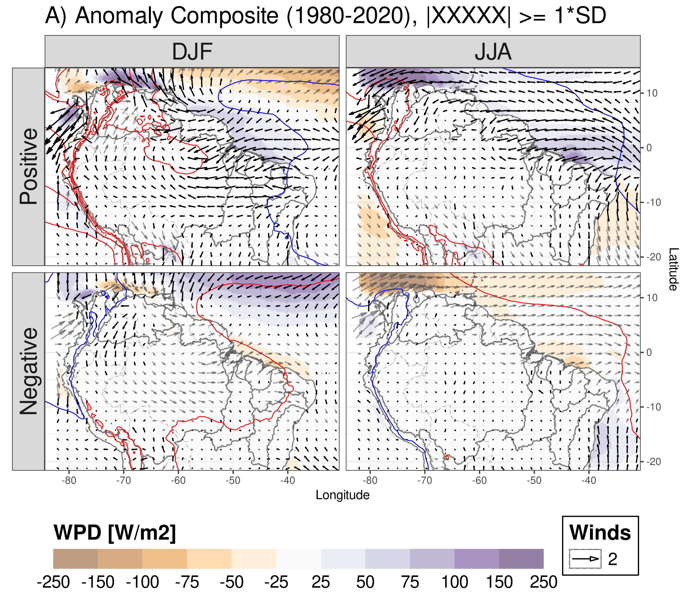

### Hi, how are you? What did catch your eye? 👋

# I'm [Nicolás Duque Gardeazabal](https://www.linkedin.com/in/nicolas-duque-gardeazabal-59a93683/)

🇨🇴🏜️⛈️🌊🇨🇭 I'm a climatologist & water resources engineer, with specific experience in modelling and analyzing hydrometeorological hazards, impacts on ⚡energy production & water resources systems through cutting edge techniques (modelling & AI). [ResearchGate](https://www.researchgate.net/profile/Nicolas-Duque-Gardeazabal)

<!--

-->
- We have investigated hydrometeorological phenomenons such as floods and droughts via mathematical models (specially using remote sensed and reanalysis data). Throughout my carreer, I have also developed several soft skills such as proactivity, communication, adaptation, work in groups, innovation and leadership. Furthermore, We've participated in water quality studies and used coding (scripts) to prepare and analyse the data produced by models with Machine Learning, geostatistics and multivariate statistical techniques.

- I am passionate about evaluating the interlink of the climate-water-food-energy nexus, the impacts on the socio-economic sphere drive me to seek & apply that knowledge. Insights from big data like climatological datasets need speciallized techniques, which I find interesting to learn; those insight have proved to be very valuable for protecting assets.

- Methodologies for modelling and designing hydraulic infrastructure (such as water supply networks in aqueducts and buildings, channels, rivers and other hydraulic infrastructure) are also in my portafolio.

- My goal is to keep working with organizations that seek protecting assets & people's livelihoods. That includes NGOs, insurance companies but also with governments; I look for helping growing and grow myself as well.

- If you are interested in knowing more, you can contact me through here or email.

<!--
**nduqueg/nduqueg** is a ✨ _special_ ✨ repository because its `README.md` (this file) appears on your GitHub profile.

Here are some ideas to get you started:

- 🔭 I’m currently working on ...
- 🌱 I’m currently learning ...
- 👯 I’m looking to collaborate on ...
- 🤔 I’m looking for help with ...
- 💬 Ask me about ...
- 📫 How to reach me: ...
- 😄 Pronouns: ...
- ⚡ Fun fact: ...
-->
